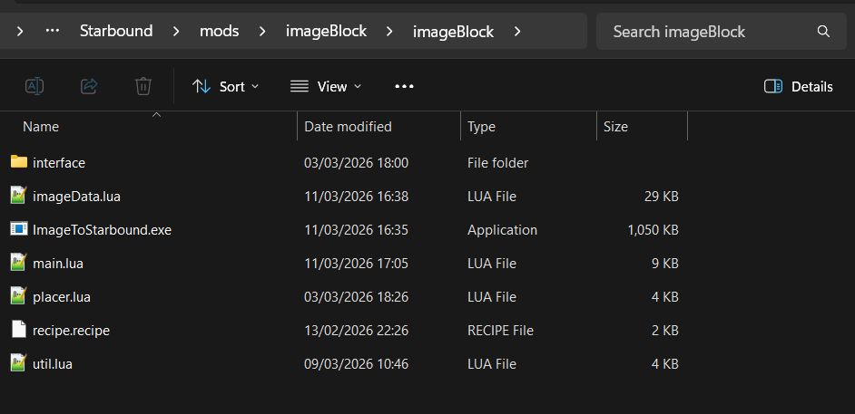
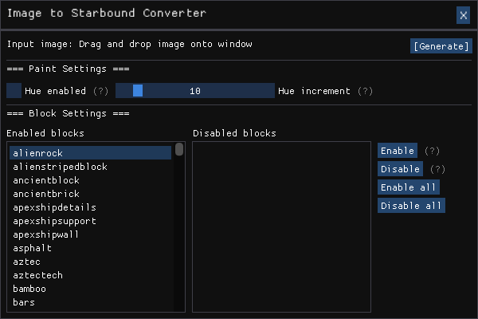

# Image to Starbound Converter

## Installing 

Download the fles and copy and paste the "imageBlock" folder to your mods folder (`/Starbound/mods/`).
When browsing your folder it should look like:

## Description

This mod contains the tools needed to convert images into placeable blocks ingame, the **.exe** converts into ingame format and the **item** allows you to place it ingame.
On a base install the .exe will be located inside your mods folder, if for whatever reason you don't want this, you can move it to anywhere on your pc and it will work the same, the output directory will be moved to be in the same location as the `.exe`, if you do decide to move it, you will need to copy the contents of "`imageData.lua`" to the `imageData.lua` inside of the item in your Starbound mod.

By default the exe is limited to images no larger than ~20000 pixels but I may change this in the future, this limit is primarily here just to avoid pasting images larger than the screen but I am on a small monitor, so for people with larger screens this limit might be too small.

## **Disclaimer**

I **do not** take any responsibility for any problems caused from this mod, I recommend **making a backup** of any world files you intend to place converted builds inside of prior to pasting any builds.
During the testing phase of this item I very occasionally ran into an issue where certain pasted builds would break my game and i had to delete the world file and start over.
I did not encounter this bug at all on the current build of the problem, i am simply stating this for the sake of transparency, if you dont want to have problems, back up your stuff.

Also when pasting, as a general rule of thumb, I would not paste images larger than your screen as this can lead to some buggy Starbound moments/lag.

## Guide on how to use

### Spawning the item

Once you have downloaded the mod and put "imageBlock" in your mods folder, it should look like `/mods/imageBlock/imageBlock/...`.
If you are not sure if it's in the right directory check your `starbound.log` and you should see "Root: Detected asset source named 'Image to Starbound Converter' at '..\mods\imageBlock'".

Once the mod is successfully installed, you need to spawn the item.
To do this you need to load onto your character, make sure you are in admin mode by typing "/admin", open the crafting menu and search for "BLOCK PASTER" and spawn it in, once its spawned you no longer need admin.

### Using the converter

To use the Image to Starbound Converter, browse to `/mods/imageBlock/imageBlock/ImageToStarbound.exe` and launch the program.
From here you can drag and drop any `.png / .jpg / .jpeg` files you wish to convert.
Once you have selected the image you wish to convert, select your desired settings (*guide on settings below*) and click the "`[Generate]`" button.

The output will get saved to `/mods/imageBlock/imageBlock/imageData.lua`.
From here all you need to do is type "/reload" if you are ingame or launch the game if you are not.
From here you can simply hold the pasting tool, then an interface should appear with two buttons for either *foreground* paste or *background* paste.
Select the paste layer, and **left click** to paste.

Enjoy!

### Paint settings

If you wish to have the output use painted blocks, tick the "Hue enabled" tick box, if you want more accurate paint to create a more accurate output decrease the slider to smaller values, this will also increase the time it takes to generate the output, inversely if you increaase the slider to larger values the paint will be less accurate, but faster to generate.

### Block settings

Currently, this settings area includes the blocks it's currently using in the "Enabled" tab (left) and the blocks it's not using in the "Disabled tab (right).
You can select blocks on the enabled tab and disable them by selecting them in the left tab and clicking disable and doing the inverse by doing the inverse.

Additionally, you can enable all blocks, or disable all blocks by clicking the respective buttons.
Currently there are no blocks affected by gravity regardless of settings but I might add these back if people want me to.

## Future plans

  - The code is currently not perfect and optimisations are in the plan for the future, including simply better written code on the item itself, fast placing and faster generating.
  - It currently is only working for Windows x64 but with enough request I might make it work for Linux or maybe even Mac if I'm feeling generous.
  - Considering making an ingame previewer for the blocks to be pasted with an option tickbox on the ingame item interface.
  - No gravity blocks invluded in the palette, might add them back if people want 

